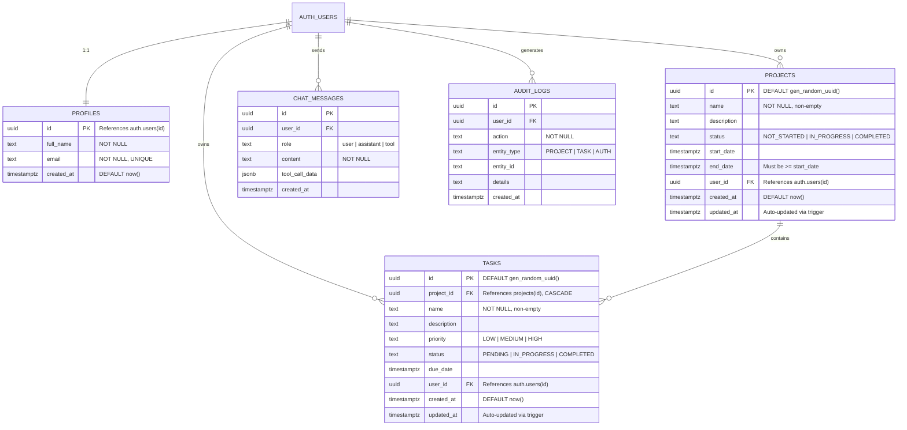

# Database Documentation

This document describes the PostgreSQL database architecture, schema definitions, integrity constraints, indexing strategies, triggers, security policies, and views for the **ProjectSync** project management application hosted on [Supabase](https://supabase.com).

---

## Table of Contents

1. [Overview](#1-overview)
2. [Entity-Relationship (ER) Diagram](#2-entity-relationship-er-diagram)
3. [Table Details](#3-table-details)
   - [3.1 profiles](#31-profiles)
   - [3.2 projects](#32-projects)
   - [3.3 tasks](#33-tasks)
   - [3.4 chat_messages](#34-chat_messages)
   - [3.5 audit_logs](#35-audit_logs)
4. [Indexes](#4-indexes)
5. [Database Triggers & Functions](#5-database-triggers--functions)
   - [5.1 Profile Auto-Creation Trigger](#51-profile-auto-creation-trigger)
   - [5.2 Automated Timestamp Update Triggers](#52-automated-timestamp-update-triggers)
6. [Row Level Security (RLS)](#6-row-level-security-rls)
   - [6.1 profiles Policies](#61-profiles-policies)
   - [6.2 projects Policies](#62-projects-policies)
   - [6.3 tasks Policies](#63-tasks-policies)
   - [6.4 chat_messages Policies](#64-chat_messages-policies)
   - [6.5 audit_logs Policies](#65-audit_logs-policies)
7. [Views](#7-views)
   - [7.1 dashboard_stats](#71-dashboard_stats)
8. [Security Notes](#8-security-notes)

---

## 1. Overview

The ProjectSync database is an enterprise-grade PostgreSQL relational database managed on **Supabase**. The platform provides core services including built-in authentication (`auth.users`), connection pooling via PgBouncer / Supavisor, real-time change data capture, and automated backups.

Key architectural highlights:
- **Tenant Isolation via Native RLS:** Data isolation across users is enforced directly at the database engine level via PostgreSQL Row Level Security (RLS) using `auth.uid()`.
- **Referential Integrity:** Primary relationships enforce foreign key constraints with `ON DELETE CASCADE` semantics to prevent orphaned records upon user or project deletion.
- **Trigger-Driven Synchronization:** Automatic provisioning of user profile records on account registration and automatic tracking of row-level modification timestamps (`updated_at`).
- **High-Performance Analytics:** Pre-aggregated views configured with `security_invoker = true` to allow instant dashboard metric computation while respecting caller security boundaries.

The database source definition is maintained in [supabase-schema.sql](file:///d:/sync_connect/supabase-schema.sql) (also mirrored in [momentum-supabase-schema-v2.sql](file:///d:/sync_connect/momentum-supabase-schema-v2.sql)).

---

## 2. Entity-Relationship (ER) Diagram

The following diagram illustrates the entity models, their primary/foreign key definitions, constraints, and relational cardinalities:



---

## 3. Table Details

### 3.1 `profiles`

The `profiles` table mirrors `auth.users` to store application-specific metadata (such as full name and contact email) that can be queried and displayed by the application layer.

| Column | Data Type | Nullable | Default | Constraints | Description |
| :--- | :--- | :--- | :--- | :--- | :--- |
| `id` | `uuid` | `NO` | *None* | `PRIMARY KEY`, `REFERENCES auth.users(id) ON DELETE CASCADE` | Matches the authenticated user's unique identifier. |
| `full_name` | `text` | `NO` | *None* | `NOT NULL` | Display name of the user. |
| `email` | `text` | `NO` | *None* | `NOT NULL`, `UNIQUE` | User email address mirrored from authentication metadata. |
| `created_at` | `timestamptz` | `YES` | `now()` | *None* | Timestamp of profile generation. |

- **Foreign Keys:**
  - `id` references `auth.users(id)` with `ON DELETE CASCADE`. When a user account is deleted from Supabase Auth, the corresponding profile row is automatically purged.
- **Check Constraints:** None.

---

### 3.2 `projects`

The `projects` table stores project entities created and managed by authenticated users.

| Column | Data Type | Nullable | Default | Constraints | Description |
| :--- | :--- | :--- | :--- | :--- | :--- |
| `id` | `uuid` | `NO` | `gen_random_uuid()` | `PRIMARY KEY` | Unique project identifier. |
| `name` | `text` | `NO` | *None* | `NOT NULL`, `CHECK (char_length(trim(name)) > 0)` | Title of the project (cannot be blank or whitespace). |
| `description` | `text` | `YES` | *None* | *None* | Markdown or text description of the project. |
| `status` | `text` | `NO` | `'NOT_STARTED'` | `CHECK (status IN ('NOT_STARTED', 'IN_PROGRESS', 'COMPLETED'))` | Current lifecycle state. |
| `start_date` | `timestamptz` | `YES` | *None* | *None* | Planned or actual start timestamp. |
| `end_date` | `timestamptz` | `YES` | *None* | *None* | Target completion or deadline timestamp. |
| `user_id` | `uuid` | `NO` | *None* | `NOT NULL`, `REFERENCES auth.users(id) ON DELETE CASCADE` | Foreign key referencing the project owner. |
| `created_at` | `timestamptz` | `YES` | `now()` | *None* | Record creation timestamp. |
| `updated_at` | `timestamptz` | `YES` | `now()` | *None* | Last update timestamp (managed via trigger). |

- **Foreign Keys:**
  - `user_id` references `auth.users(id)` with `ON DELETE CASCADE`. If the user is removed, all associated projects are cascadingly deleted.
- **Check Constraints:**
  - `projects_name_check`: `char_length(trim(name)) > 0` (prevents empty string or space-only titles).
  - `projects_status_check`: `status IN ('NOT_STARTED', 'IN_PROGRESS', 'COMPLETED')`.
  - `valid_date_range`: `end_date IS NULL OR start_date IS NULL OR end_date >= start_date` (ensures logical consistency between dates).

---

### 3.3 `tasks`

The `tasks` table stores individual task items nested under projects. It includes a denormalized `user_id` reference to optimize single-table Row Level Security query execution.

| Column | Data Type | Nullable | Default | Constraints | Description |
| :--- | :--- | :--- | :--- | :--- | :--- |
| `id` | `uuid` | `NO` | `gen_random_uuid()` | `PRIMARY KEY` | Unique task identifier. |
| `project_id` | `uuid` | `NO` | *None* | `NOT NULL`, `REFERENCES public.projects(id) ON DELETE CASCADE` | Parent project container identifier. |
| `name` | `text` | `NO` | *None* | `NOT NULL`, `CHECK (char_length(trim(name)) > 0)` | Task title (non-empty). |
| `description` | `text` | `YES` | *None* | *None* | Detailed task scope or instructions. |
| `priority` | `text` | `NO` | `'MEDIUM'` | `CHECK (priority IN ('LOW', 'MEDIUM', 'HIGH'))` | Priority classification level. |
| `status` | `text` | `NO` | `'PENDING'` | `CHECK (status IN ('PENDING', 'IN_PROGRESS', 'COMPLETED'))` | Task progression status. |
| `due_date` | `timestamptz` | `YES` | *None* | *None* | Target deadline. |
| `user_id` | `uuid` | `NO` | *None* | `NOT NULL`, `REFERENCES auth.users(id) ON DELETE CASCADE` | Direct owner identifier for high-performance RLS. |
| `created_at` | `timestamptz` | `YES` | `now()` | *None* | Record creation timestamp. |
| `updated_at` | `timestamptz` | `YES` | `now()` | *None* | Timestamp updated automatically by trigger on change. |

- **Foreign Keys:**
  - `project_id` references `public.projects(id)` with `ON DELETE CASCADE`. Deleting a project automatically deletes all related tasks.
  - `user_id` references `auth.users(id)` with `ON DELETE CASCADE`. Deleting a user purges all their tasks.
- **Check Constraints:**
  - `tasks_name_check`: `char_length(trim(name)) > 0`.
  - `tasks_priority_check`: `priority IN ('LOW', 'MEDIUM', 'HIGH')`.
  - `tasks_status_check`: `status IN ('PENDING', 'IN_PROGRESS', 'COMPLETED')`.

---

### 3.4 `chat_messages`

The `chat_messages` table provides audit and conversation persistence for the Groq-powered AI assistant and tool calling workflows.

| Column | Data Type | Nullable | Default | Constraints | Description |
| :--- | :--- | :--- | :--- | :--- | :--- |
| `id` | `uuid` | `NO` | `gen_random_uuid()` | `PRIMARY KEY` | Unique message identifier. |
| `user_id` | `uuid` | `NO` | *None* | `NOT NULL`, `REFERENCES auth.users(id) ON DELETE CASCADE` | Identifies the session owner. |
| `role` | `text` | `NO` | *None* | `NOT NULL`, `CHECK (role IN ('user', 'assistant', 'tool'))` | Speaker role in chat conversation. |
| `content` | `text` | `NO` | *None* | `NOT NULL` | Message body payload or response string. |
| `tool_call_data` | `jsonb` | `YES` | *None* | *None* | Structured tool execution input/output arguments. |
| `created_at` | `timestamptz` | `YES` | `now()` | *None* | Message creation timestamp. |

- **Foreign Keys:**
  - `user_id` references `auth.users(id)` with `ON DELETE CASCADE`.
- **Check Constraints:**
  - `chat_messages_role_check`: `role IN ('user', 'assistant', 'tool')`.

---

### 3.5 `audit_logs`

The `audit_logs` table tracks security events, administrative updates, and user activities for compliance and debugging.

| Column | Data Type | Nullable | Default | Constraints | Description |
| :--- | :--- | :--- | :--- | :--- | :--- |
| `id` | `uuid` | `NO` | `gen_random_uuid()` | `PRIMARY KEY` | Unique log entry identifier. |
| `user_id` | `uuid` | `NO` | *None* | `NOT NULL`, `REFERENCES auth.users(id) ON DELETE CASCADE` | Actor who performed the action. |
| `action` | `text` | `NO` | *None* | `NOT NULL` | Action description (e.g., `CREATE`, `UPDATE`, `LOGIN`). |
| `entity_type` | `text` | `NO` | *None* | `NOT NULL`, `CHECK (entity_type IN ('PROJECT', 'TASK', 'AUTH'))` | Category of entity impacted. |
| `entity_id` | `text` | `YES` | *None* | *None* | Identifier of affected target record. |
| `details` | `text` | `YES` | *None* | *None* | Human-readable or structured details of the change. |
| `created_at` | `timestamptz` | `YES` | `now()` | *None* | Timestamp of action. |

- **Foreign Keys:**
  - `user_id` references `auth.users(id)` with `ON DELETE CASCADE`.
- **Check Constraints:**
  - `audit_logs_entity_type_check`: `entity_type IN ('PROJECT', 'TASK', 'AUTH')`.

---

## 4. Indexes

The schema configures B-Tree indexes optimized for filter queries, foreign key joins, and chronologically sorted list operations:

| Index Name | Table | Columns | Type | Purpose / Query Optimization |
| :--- | :--- | :--- | :--- | :--- |
| `idx_projects_status` | `projects` | `status` | B-Tree | Accelerates project filtering by status (`NOT_STARTED`, `IN_PROGRESS`, `COMPLETED`). |
| `idx_projects_user_id` | `projects` | `user_id` | B-Tree | Optimizes RLS validation and `WHERE user_id = :uid` project lookups. |
| `idx_tasks_project_id` | `tasks` | `project_id` | B-Tree | Speeds up task retrieval by parent project and foreign key joins (`JOIN tasks ON tasks.project_id = projects.id`). |
| `idx_tasks_status` | `tasks` | `status` | B-Tree | Accelerates task filtering by status in kanban and list views. |
| `idx_tasks_priority` | `tasks` | `priority` | B-Tree | Accelerates task filtering by priority (`HIGH`, `MEDIUM`, `LOW`). |
| `idx_tasks_user_id` | `tasks` | `user_id` | B-Tree | Crucial for single-table task lookups under RLS policies without project joins. |
| `idx_chat_messages_user_id` | `chat_messages` | `user_id, created_at` | B-Tree (Composite) | Supports chronological ordering and pagination of conversational history per user. |
| `idx_audit_logs_user_id` | `audit_logs` | `user_id, created_at DESC` | B-Tree (Composite) | Optimizes retrieval of the user's latest audit trail events in descending time order. |

---

## 5. Database Triggers & Functions

### 5.1 Profile Auto-Creation Trigger

When a new user registers through Supabase Auth, an automated trigger creates a corresponding profile row in `public.profiles`.

- **Trigger Name:** `on_auth_user_created`
- **Target Table:** `auth.users`
- **Timing / Event:** `AFTER INSERT ON auth.users FOR EACH ROW`
- **Execution Function:** `public.handle_new_user()`
- **Security:** `SECURITY DEFINER` (executes with elevated database permissions to access `public.profiles` across schema boundaries).

```sql
create or replace function public.handle_new_user()
returns trigger as $$
begin
  insert into public.profiles (id, full_name, email)
  values (
    new.id,
    coalesce(new.raw_user_meta_data->>'full_name', ''),
    new.email
  )
  on conflict (id) do update set
    full_name = excluded.full_name,
    email = excluded.email;
  return new;
end;
$$ language plpgsql security definer;

create trigger on_auth_user_created
  after insert on auth.users
  for each row execute procedure public.handle_new_user();
```

---

### 5.2 Automated Timestamp Update Triggers

To maintain strict data auditing without requiring client-side timestamp calculations, an update trigger keeps `updated_at` refreshed to the exact current timestamp on any row change.

- **Trigger Function:** `public.set_updated_at()`
- **Language:** PL/pgSQL

```sql
create or replace function public.set_updated_at()
returns trigger as $$
begin
  new.updated_at = now();
  return new;
end;
$$ language plpgsql;
```

#### Associated Triggers:

1. **`set_projects_updated_at`**
   - **Table:** `public.projects`
   - **Timing / Event:** `BEFORE UPDATE ON public.projects FOR EACH ROW`
   - **Action:** Sets `new.updated_at = now()`
2. **`set_tasks_updated_at`**
   - **Table:** `public.tasks`
   - **Timing / Event:** `BEFORE UPDATE ON public.tasks FOR EACH ROW`
   - **Action:** Sets `new.updated_at = now()`

---

## 6. Row Level Security (RLS)

All tables in the `public` schema have Row Level Security enabled (`ALTER TABLE ... ENABLE ROW LEVEL SECURITY`). Access policies enforce per-user data tenancy by verifying the executing session's authenticated JWT UUID (`auth.uid()`).

### 6.1 `profiles` Policies

| Policy Name | Action | Using Clause | With Check Clause | Description |
| :--- | :--- | :--- | :--- | :--- |
| `"Users can view own profile"` | `SELECT` | `auth.uid() = id` | — | Users can only query their own profile record. |
| `"Users can update own profile"` | `UPDATE` | `auth.uid() = id` | — | Users can modify their own profile data. |
| `"Users can insert own profile"` | `INSERT` | — | `auth.uid() = id` | Users can only insert records matching their authenticated UUID. |

---

### 6.2 `projects` Policies

| Policy Name | Action | Using Clause | With Check Clause | Description |
| :--- | :--- | :--- | :--- | :--- |
| `"Users can view own projects"` | `SELECT` | `auth.uid() = user_id` | — | Only owner can view project records. |
| `"Users can insert own projects"` | `INSERT` | — | `auth.uid() = user_id` | Inserts must attribute ownership to the active session. |
| `"Users can update own projects"` | `UPDATE` | `auth.uid() = user_id` | `auth.uid() = user_id` | Updates cannot reassign `user_id` or modify other users' projects. |
| `"Users can delete own projects"` | `DELETE` | `auth.uid() = user_id` | — | Only owner can remove their projects. |

---

### 6.3 `tasks` Policies

Tasks are protected via the denormalized `user_id` column, guaranteeing fast evaluation without nested subqueries on `projects`.

| Policy Name | Action | Using Clause | With Check Clause | Description |
| :--- | :--- | :--- | :--- | :--- |
| `"Users can view own tasks"` | `SELECT` | `auth.uid() = user_id` | — | Only owner can read task records. |
| `"Users can insert own tasks"` | `INSERT` | — | `auth.uid() = user_id` | User can only insert tasks owned by their UUID. |
| `"Users can update own tasks"` | `UPDATE` | `auth.uid() = user_id` | `auth.uid() = user_id` | Prevents unauthorized modifications and cross-user reassignment. |
| `"Users can delete own tasks"` | `DELETE` | `auth.uid() = user_id` | — | Only task owner can delete tasks. |

---

### 6.4 `chat_messages` Policies

| Policy Name | Action | Using Clause | With Check Clause | Description |
| :--- | :--- | :--- | :--- | :--- |
| `"Users can view own chat messages"` | `SELECT` | `auth.uid() = user_id` | — | Users can only read their conversational thread. |
| `"Users can insert own chat messages"` | `INSERT` | — | `auth.uid() = user_id` | Ensures appended messages belong to the authenticated sender. |

---

### 6.5 `audit_logs` Policies

| Policy Name | Action | Using Clause | With Check Clause | Description |
| :--- | :--- | :--- | :--- | :--- |
| `"Users can view own audit logs"` | `SELECT` | `auth.uid() = user_id` | — | Users can only inspect their personal audit events. |
| `"Users can insert own audit logs"` | `INSERT` | — | `auth.uid() = user_id` | Logs must reference the current authenticated user. |

---

## 7. Views

### 7.1 `dashboard_stats`

The `dashboard_stats` view aggregates project and task metrics per user in a single optimized query.

#### Definition:

```sql
create or replace view public.dashboard_stats as
select
  p.user_id,
  count(distinct p.id) as total_projects,
  count(distinct p.id) filter (where p.status = 'IN_PROGRESS') as projects_in_progress,
  count(t.id) as total_tasks,
  count(t.id) filter (where t.status = 'COMPLETED') as completed_tasks,
  count(t.id) filter (where t.status != 'COMPLETED') as pending_tasks
from public.projects p
left join public.tasks t on t.project_id = p.id
group by p.user_id;

alter view public.dashboard_stats set (security_invoker = true);
```

#### Output Schema:

| Column | Data Type | Description |
| :--- | :--- | :--- |
| `user_id` | `uuid` | Owner identifier for the aggregated statistics. |
| `total_projects` | `bigint` | Total count of distinct projects belonging to the user. |
| `projects_in_progress` | `bigint` | Count of user projects currently in `IN_PROGRESS` status. |
| `total_tasks` | `bigint` | Total count of tasks linked across all user projects. |
| `completed_tasks` | `bigint` | Count of tasks marked with `COMPLETED` status. |
| `pending_tasks` | `bigint` | Count of tasks in `PENDING` or `IN_PROGRESS` status. |

#### Security Invoker Rationale:
By specifying `security_invoker = true`, the view executes with the privileges and Row Level Security policies of the **calling user** rather than the view's creator. This guarantees that when an authenticated user queries `dashboard_stats`, PostgreSQL automatically filters the underlying `projects` and `tasks` tables through their respective RLS policies, preventing cross-tenant metric leakage.

---

## 8. Security Notes

1. **Client-Side Communication & Injection Immunity:**
   - All client queries use the official Supabase JavaScript SDK ([supabaseClient.ts](file:///d:/sync_connect/src/services/supabaseClient.ts)) connecting to the Supabase PostgREST endpoint.
   - All input parameters are automatically parameterized by the PostgREST layer, eliminating SQL injection attack vectors.

2. **Row Level Security (RLS) as Zero-Trust Guard:**
   - Even if client code attempts to query without filters (e.g., `supabase.from('projects').select('*')`), the database engine evaluates `auth.uid() = user_id` for each row candidates. Cross-user data leakage is strictly blocked at the storage engine level.

3. **Credential Storage & Authentication:**
   - Passwords are never stored in `public` tables. Authentication is exclusively managed by the protected `auth` schema using industry-standard bcrypt hashing with per-user salts.
   - JWT tokens generated upon authentication are signed cryptographically and validated on every request.

4. **Key Segregation (Anon vs. Service Role):**
   - The frontend application only holds the public `anon` key (`VITE_SUPABASE_ANON_KEY`), which is subject to all RLS policies.
   - The administrative `service_role` key (which bypasses RLS) is strictly reserved for backend server environments and is never exposed in client bundles or public repositories.
