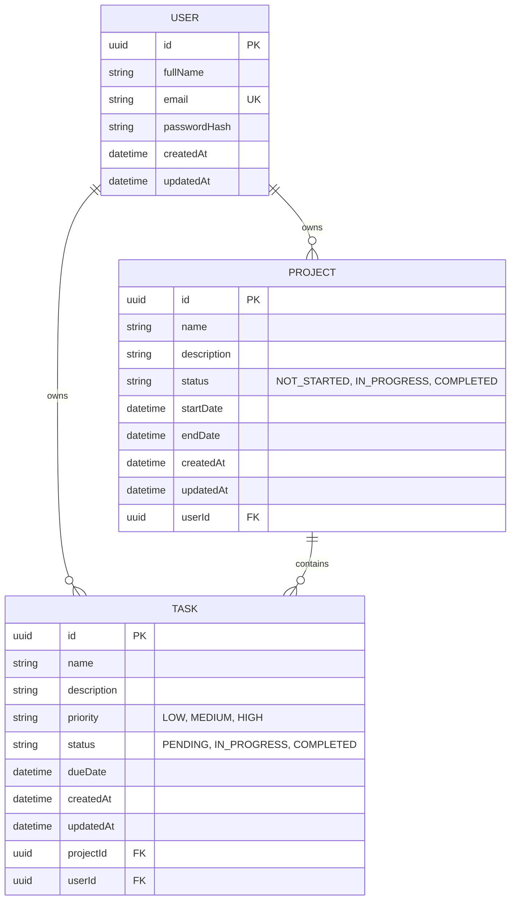

# ER Diagram

```mermaid
erDiagram
    USER ||--o{ PROJECT : owns
    USER ||--o{ TASK : owns
    PROJECT ||--o{ TASK : contains

    USER {
        uuid id PK
        string fullName
        string email UK
        string passwordHash
        datetime createdAt
        datetime updatedAt
    }

    PROJECT {
        uuid id PK
        string name
        string description
        string status "NOT_STARTED, IN_PROGRESS, COMPLETED"
        datetime startDate
        datetime endDate
        datetime createdAt
        datetime updatedAt
        uuid userId FK
    }

    TASK {
        uuid id PK
        string name
        string description
        string priority "LOW, MEDIUM, HIGH"
        string status "PENDING, IN_PROGRESS, COMPLETED"
        datetime dueDate
        datetime createdAt
        datetime updatedAt
        uuid projectId FK
        uuid userId FK
    }
```
